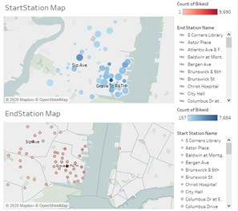

# Tableau-visualizations-

##Imagine you waking up to find out that your power point presentation never printed out or laptop never powered on. Well Tableau visualizations brings the power to combined big data sets into amazing visualizations so you may catch that 8am meeting and be able to present a visual that will get you promoted!  

###The following visualizations will take you to levels that you never imagined that were possible, until today. Enjoy! 

The below Dashboard tells you the combinations of gender types, trip duration and the user type. 

 

The Below Dashboard tells you the names and the total number of stations ID's from begining to the end. 

 

The following image tells you that 8am is the peak time where riders begin. 

The following image tells you that male bikers have the most subscribers within the bikerids.,  

The following image tells you that Grove St Path has 7,684 bike subscribers

 

The following image tells you through December2019-March-2020 subscribers had a trip of 65k. 

 

The following image tells you the end station map  

 

*My conclusion of this fantastic set of data that incuded many riders that wake up in the morning to ride and have a healthy and balanced lifestyle. The start and end stations name Grove St Path had a lot of bikers that hung out there. One the best inventions ever created was the Tabluea where the powerful tools that is possess makes any job easy and fast to accomplish. If you are ever in a tough situation let me tackle it head on with* **Tableau!** 

